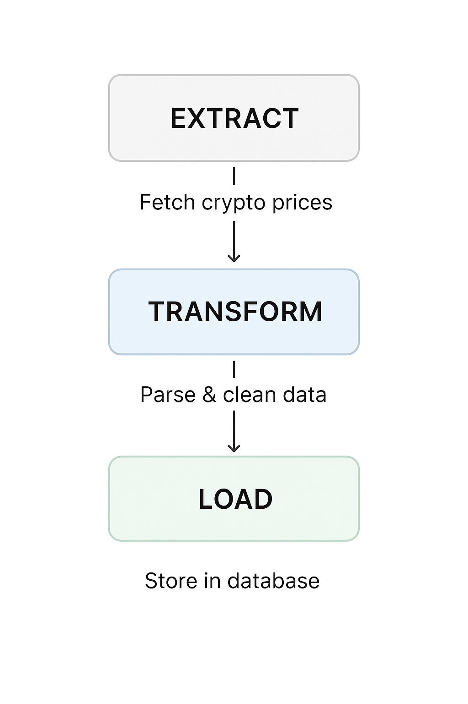

# Crypto Price ETL Pipeline

This project demonstrates a simple ETL (Extract, Transform, Load) pipeline for fetching real-time cryptocurrency data from the CoinGecko API, transforming it into a structured format and storing it into a SQLite database for further analysis.

# Features

- Extracts live prices and market caps of Bitcoin and Ethereum (can be extended to more coins).

- Transforms raw API JSON into structured rows with timestamps.

- Loads the data into a SQLite database (crypto_data.db).

- Automatically runs every hour using the schedule library.

